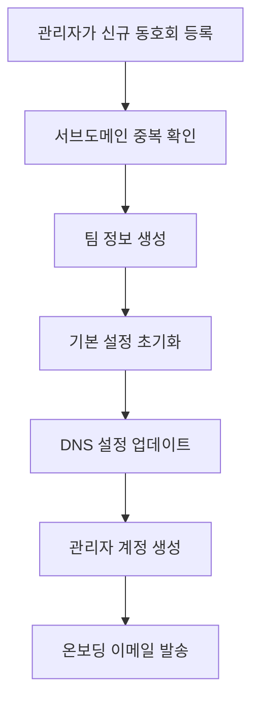

# 테넌트 관리 시스템 설계 가이드

## 🏢 테넌트 라이프사이클 관리

### 1. 테넌트 생성 프로세스

#### 신규 동호회 등록 플로우


#### 테넌트 생성 API
```kotlin
@RestController
@RequestMapping("/admin/tenants")
@PreAuthorize("hasRole('SUPER_ADMIN')")
class TenantManagementController(
    private val tenantService: TenantService,
    private val dnsService: DNSService,
    private val emailService: EmailService
) {
    
    @PostMapping
    @Transactional
    fun createTenant(@Valid @RequestBody request: CreateTenantRequest): ResponseEntity<TenantDto> {
        // 1. 서브도메인 중복 확인
        if (tenantService.existsBySubdomain(request.subdomain)) {
            throw ConflictException("Subdomain '${request.subdomain}' already exists")
        }
        
        // 2. 팀 엔티티 생성
        val team = tenantService.createTeam(request)
        
        // 3. 기본 설정 초기화
        val tenantConfig = tenantService.initializeTenantConfig(team.id, request)
        
        // 4. DNS 설정 (외부 서비스)
        dnsService.createSubdomainRecord("${request.subdomain}.football-club.kr")
        
        // 5. 관리자 계정 생성
        val adminUser = tenantService.createTenantAdmin(team.id, request.adminInfo)
        
        // 6. 온보딩 이메일 발송
        emailService.sendTenantWelcomeEmail(adminUser.email, tenantConfig)
        
        return ResponseEntity.status(HttpStatus.CREATED)
            .body(team.toDto())
    }
}

data class CreateTenantRequest(
    val subdomain: String,
    val teamName: String,
    val description: String?,
    val adminInfo: AdminUserInfo,
    val subscriptionPlan: String = "basic",
    val customization: TenantCustomization? = null
)

data class AdminUserInfo(
    val email: String,
    val name: String,
    val phone: String?
)

data class TenantCustomization(
    val primaryColor: String = "#0ea5e9",
    val secondaryColor: String = "#64748b", 
    val logoUrl: String? = null,
    val customCSS: String? = null
)
```

### 2. 테넌트 설정 관리

#### 테넌트 설정 엔티티
```kotlin
@Entity
@Table(name = "tenant_configs")
data class TenantConfig(
    @Id
    val teamId: Long,
    
    @Column(unique = true, nullable = false)
    val subdomain: String,
    
    // 커스터마이징 설정
    val logoUrl: String? = null,
    val primaryColor: String = "#0ea5e9",
    val secondaryColor: String = "#64748b",
    val customCSS: String? = null,
    val customDomain: String? = null, // 향후 커스텀 도메인 지원
    
    // 구독 및 사용량 관리
    val subscriptionPlan: String = "basic", // basic, pro, enterprise
    val isActive: Boolean = true,
    val maxPlayers: Int = 50,
    val maxStadiums: Int = 10,
    val maxMatches: Int = 100,
    
    // 기능 플래그
    val enableAdvancedStats: Boolean = false,
    val enableCustomization: Boolean = true,
    val enableAPIAccess: Boolean = false,
    
    // 메타데이터
    @CreationTimestamp
    val createdAt: LocalDateTime = LocalDateTime.now(),
    
    @UpdateTimestamp
    val updatedAt: LocalDateTime = LocalDateTime.now()
) {
    fun isFeatureEnabled(feature: TenantFeature): Boolean {
        return when (feature) {
            TenantFeature.ADVANCED_STATS -> enableAdvancedStats
            TenantFeature.CUSTOMIZATION -> enableCustomization
            TenantFeature.API_ACCESS -> enableAPIAccess
        }
    }
    
    fun getSubscriptionLimits(): SubscriptionLimits {
        return when (subscriptionPlan) {
            "basic" -> SubscriptionLimits(
                players = 30, stadiums = 5, matches = 50,
                storage = "1GB", apiCalls = 1000
            )
            "pro" -> SubscriptionLimits(
                players = 100, stadiums = 20, matches = 200,
                storage = "10GB", apiCalls = 10000
            )
            "enterprise" -> SubscriptionLimits(
                players = Int.MAX_VALUE, stadiums = Int.MAX_VALUE,
                matches = Int.MAX_VALUE, storage = "100GB", apiCalls = 100000
            )
            else -> SubscriptionLimits()
        }
    }
}

enum class TenantFeature {
    ADVANCED_STATS, CUSTOMIZATION, API_ACCESS
}

data class SubscriptionLimits(
    val players: Int = 30,
    val stadiums: Int = 5,
    val matches: Int = 50,
    val storage: String = "1GB",
    val apiCalls: Int = 1000
)
```

### 3. 테넌트 사용량 추적

#### 사용량 모니터링 서비스
```kotlin
@Service
class TenantUsageService(
    private val usageRepository: TenantUsageRepository,
    private val tenantConfigRepository: TenantConfigRepository
) {
    
    @Async
    fun recordApiCall(teamId: Long, endpoint: String, responseTime: Long) {
        val usage = TenantUsage(
            teamId = teamId,
            resourceType = "API_CALL",
            resourceName = endpoint,
            count = 1,
            metadata = mapOf(
                "responseTime" to responseTime,
                "timestamp" to Instant.now()
            )
        )
        usageRepository.save(usage)
    }
    
    fun checkUsageLimits(teamId: Long, resourceType: String): UsageLimitResult {
        val config = tenantConfigRepository.findByTeamId(teamId)
            ?: throw TenantNotFoundException("Tenant not found: $teamId")
        
        val limits = config.getSubscriptionLimits()
        val currentUsage = getCurrentUsage(teamId, resourceType)
        
        return when (resourceType) {
            "PLAYER" -> UsageLimitResult(
                allowed = currentUsage < limits.players,
                current = currentUsage,
                limit = limits.players
            )
            "STADIUM" -> UsageLimitResult(
                allowed = currentUsage < limits.stadiums,
                current = currentUsage,
                limit = limits.stadiums
            )
            else -> UsageLimitResult(allowed = true, current = 0, limit = Int.MAX_VALUE)
        }
    }
    
    private fun getCurrentUsage(teamId: Long, resourceType: String): Int {
        return when (resourceType) {
            "PLAYER" -> playerRepository.countByTeamId(teamId)
            "STADIUM" -> stadiumRepository.countByTeamId(teamId)
            "MATCH" -> matchRepository.countByTeamId(teamId)
            else -> 0
        }
    }
}

@Entity
@Table(name = "tenant_usage")
data class TenantUsage(
    @Id
    @GeneratedValue(strategy = GenerationType.IDENTITY)
    val id: Long = 0,
    
    val teamId: Long,
    val resourceType: String, // API_CALL, STORAGE, PLAYER, STADIUM
    val resourceName: String,
    val count: Int,
    
    @Type(type = "json")
    val metadata: Map<String, Any> = emptyMap(),
    
    @CreationTimestamp
    val recordedAt: LocalDateTime = LocalDateTime.now()
)

data class UsageLimitResult(
    val allowed: Boolean,
    val current: Int,
    val limit: Int,
    val warningThreshold: Double = 0.8
) {
    val isNearLimit: Boolean
        get() = current.toDouble() / limit >= warningThreshold
}
```

### 4. 테넌트별 커스터마이징

#### 동적 테마 적용 시스템
```kotlin
@RestController  
@RequestMapping("/api/v1/theme")
class ThemeController(
    private val themeService: ThemeService
) {
    
    @GetMapping
    fun getCurrentTheme(@RequestHeader("Host") host: String): ResponseEntity<ThemeDto> {
        val subdomain = subdomainService.extractSubdomain(host)
            ?: return ResponseEntity.notFound().build()
            
        val theme = themeService.getThemeBySubdomain(subdomain)
        return ResponseEntity.ok(theme)
    }
    
    @PutMapping
    @PreAuthorize("hasRole('TENANT_ADMIN')")
    fun updateTheme(
        @RequestHeader("Host") host: String,
        @Valid @RequestBody request: UpdateThemeRequest
    ): ResponseEntity<ThemeDto> {
        val tenantContext = TenantContextHolder.getContext()
        val updatedTheme = themeService.updateTheme(tenantContext.teamId, request)
        
        // 캐시 무효화
        themeCache.evict("theme:${tenantContext.subdomain}")
        
        return ResponseEntity.ok(updatedTheme)
    }
}

@Service
class ThemeService(
    private val tenantConfigRepository: TenantConfigRepository
) {
    
    @Cacheable("theme", key = "#subdomain")
    fun getThemeBySubdomain(subdomain: String): ThemeDto {
        val config = tenantConfigRepository.findBySubdomain(subdomain)
            ?: throw TenantNotFoundException("Tenant not found: $subdomain")
            
        return ThemeDto(
            primaryColor = config.primaryColor,
            secondaryColor = config.secondaryColor,
            logoUrl = config.logoUrl,
            customCSS = config.customCSS,
            fonts = getCustomFonts(config),
            brandName = config.teamName
        )
    }
    
    private fun getCustomFonts(config: TenantConfig): Map<String, String> {
        // 구독 플랜에 따른 폰트 제공
        return when (config.subscriptionPlan) {
            "enterprise" -> mapOf(
                "primary" to "Inter, system-ui, sans-serif",
                "secondary" to "Roboto, Arial, sans-serif"
            )
            else -> mapOf(
                "primary" to "system-ui, -apple-system, sans-serif"
            )
        }
    }
}
```

### 5. 테넌트 생명주기 관리

#### 테넌트 일시정지/비활성화
```kotlin
@Service
class TenantLifecycleService(
    private val tenantConfigRepository: TenantConfigRepository,
    private val dnsService: DNSService,
    private val backupService: BackupService
) {
    
    @Transactional
    fun suspendTenant(teamId: Long, reason: String) {
        val config = tenantConfigRepository.findByTeamId(teamId)
            ?: throw TenantNotFoundException("Tenant not found: $teamId")
        
        // 1. 테넌트 비활성화
        config.isActive = false
        tenantConfigRepository.save(config)
        
        // 2. DNS 일시정지 페이지로 리다이렉트
        dnsService.redirectToSuspensionPage("${config.subdomain}.football-club.kr")
        
        // 3. 일시정지 로그 기록
        tenantEventService.recordEvent(
            teamId = teamId,
            event = TenantEvent.SUSPENDED,
            reason = reason
        )
        
        logger.warn("Tenant suspended - TeamId: $teamId, Reason: $reason")
    }
    
    @Transactional
    fun deleteTenant(teamId: Long, deleteData: Boolean = false) {
        val config = tenantConfigRepository.findByTeamId(teamId)
            ?: throw TenantNotFoundException("Tenant not found: $teamId")
        
        // 1. 데이터 백업 (GDPR 준수)
        if (deleteData) {
            backupService.createFinalBackup(teamId)
        }
        
        // 2. DNS 레코드 삭제
        dnsService.deleteSubdomainRecord("${config.subdomain}.football-club.kr")
        
        // 3. 관련 데이터 삭제
        if (deleteData) {
            deleteAllTenantData(teamId)
        } else {
            // 소프트 삭제 (30일 유예기간)
            markTenantForDeletion(teamId)
        }
        
        // 4. 삭제 로그 기록
        tenantEventService.recordEvent(
            teamId = teamId,
            event = TenantEvent.DELETED,
            metadata = mapOf("hardDelete" to deleteData)
        )
        
        logger.info("Tenant deleted - TeamId: $teamId, HardDelete: $deleteData")
    }
    
    private fun deleteAllTenantData(teamId: Long) {
        // 순서대로 관련 데이터 삭제
        matchRepository.deleteByTeamId(teamId)
        playerRepository.deleteByTeamId(teamId)
        stadiumRepository.deleteByTeamId(teamId)
        tenantUsageRepository.deleteByTeamId(teamId)
        tenantConfigRepository.deleteByTeamId(teamId)
        teamRepository.deleteById(teamId)
    }
}

enum class TenantEvent {
    CREATED, ACTIVATED, SUSPENDED, REACTIVATED, DELETED, 
    PLAN_UPGRADED, PLAN_DOWNGRADED, CUSTOM_DOMAIN_ADDED
}
```

### 6. 테넌트 관리 대시보드

#### 관리자 대시보드 API
```kotlin
@RestController
@RequestMapping("/admin/dashboard")
@PreAuthorize("hasRole('SUPER_ADMIN')")
class AdminDashboardController(
    private val dashboardService: AdminDashboardService
) {
    
    @GetMapping("/overview")
    fun getDashboardOverview(): ResponseEntity<DashboardOverviewDto> {
        val overview = dashboardService.getOverview()
        return ResponseEntity.ok(overview)
    }
    
    @GetMapping("/tenants")
    fun getAllTenants(
        @RequestParam(defaultValue = "0") page: Int,
        @RequestParam(defaultValue = "20") size: Int,
        @RequestParam(required = false) status: String?,
        @RequestParam(required = false) plan: String?
    ): ResponseEntity<Page<TenantSummaryDto>> {
        val pageable = PageRequest.of(page, size)
        val tenants = dashboardService.getTenantList(pageable, status, plan)
        return ResponseEntity.ok(tenants)
    }
    
    @GetMapping("/tenants/{teamId}/metrics")
    fun getTenantMetrics(
        @PathVariable teamId: Long,
        @RequestParam(defaultValue = "30") days: Int
    ): ResponseEntity<TenantMetricsDto> {
        val metrics = dashboardService.getTenantMetrics(teamId, days)
        return ResponseEntity.ok(metrics)
    }
}

data class DashboardOverviewDto(
    val totalTenants: Int,
    val activeTenants: Int,
    val suspendedTenants: Int,
    val totalRevenue: BigDecimal,
    val newTenantsThisMonth: Int,
    val topTenantsByUsage: List<TenantUsageSummary>,
    val systemHealth: SystemHealthDto
)

data class TenantMetricsDto(
    val teamId: Long,
    val subdomain: String,
    val dailyApiCalls: Map<String, Long>,
    val resourceUsage: Map<String, Int>,
    val storageUsed: Long,
    val activeUsers: Int,
    val subscriptionPlan: String,
    val isNearLimits: Boolean
)
```

## 📊 테넌트 분석 및 최적화

### 성능 모니터링
```kotlin
@Component
class TenantPerformanceMonitor {
    
    @EventListener
    fun handleApiCall(event: ApiCallEvent) {
        // 테넌트별 API 응답시간 추적
        meterRegistry.timer("api.response.time", "tenant", event.subdomain)
            .record(event.responseTime, TimeUnit.MILLISECONDS)
            
        // 사용량 임계치 체크
        if (isNearUsageLimit(event.teamId)) {
            sendUsageWarningEmail(event.teamId)
        }
    }
    
    @Scheduled(fixedRate = 300000) // 5분마다
    fun collectTenantMetrics() {
        tenantConfigRepository.findAllActive()
            .forEach { config ->
                val metrics = collectMetricsForTenant(config.teamId)
                tenantMetricsRepository.save(metrics)
            }
    }
}
```

이 테넌트 관리 시스템으로 동호회별 독립적이고 확장 가능한 서비스를 제공할 수 있습니다.